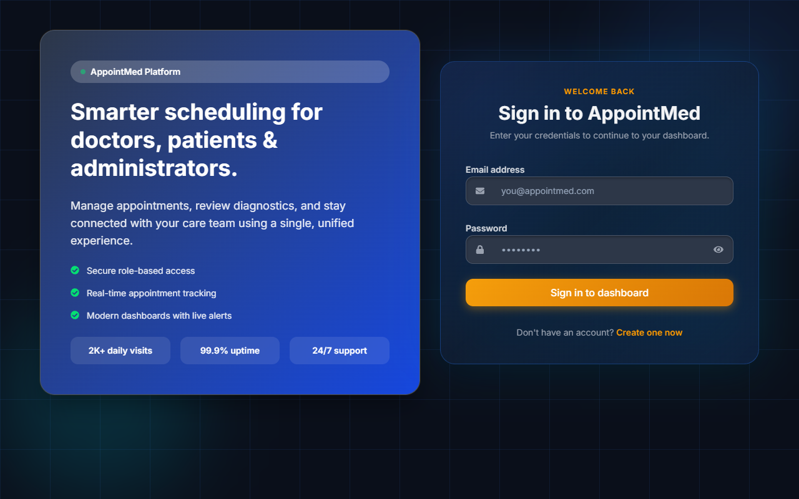
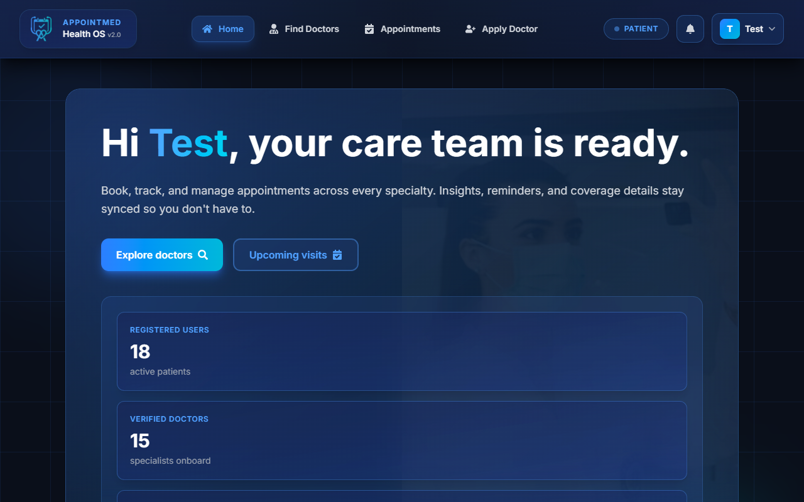
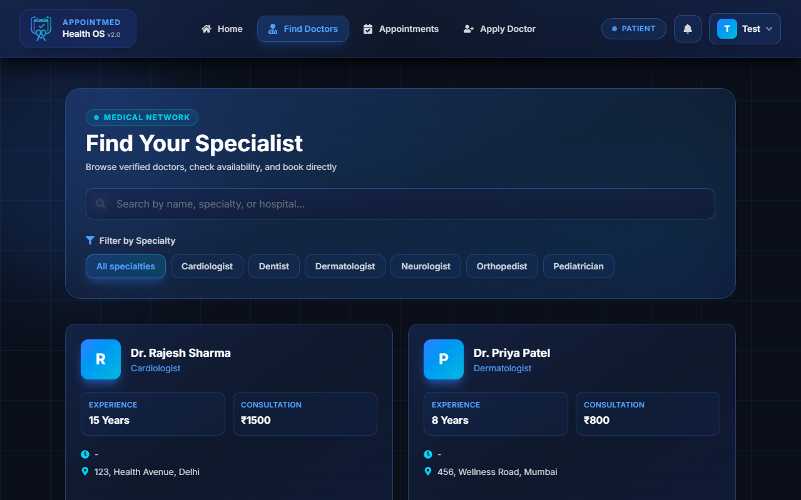
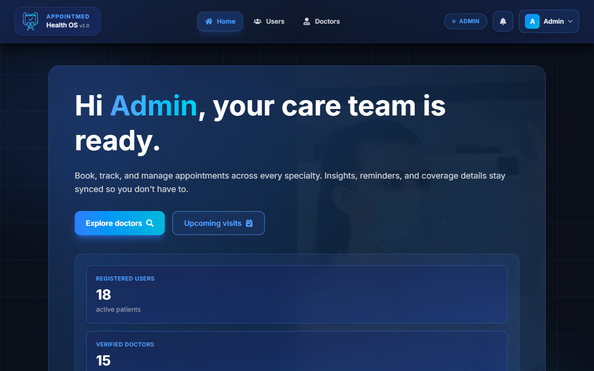

# 🏥 AppointMed - Healthcare Appointment Management System

[](https://opensource.org/licenses/MIT)
[](https://reactjs.org/)
[](https://nodejs.org/)
[](https://www.mongodb.com/)

A modern, full-stack healthcare appointment management system that seamlessly connects patients with verified doctors. Built with the MERN stack and featuring a stunning dark-mode UI with smooth animations.

## ✨ Features

### 👨‍⚕️ For Patients

- **Find & Book Doctors**: Browse verified doctors by specialization and availability
- **Appointment Management**: View, track, and manage all your appointments
- **Apply to Become a Doctor**: Submit applications with credentials and practice information
- **Profile Management**: Update personal information and health metrics
- **Real-time Notifications**: Get instant updates on appointment status

### 👩‍⚕️ For Doctors

- **Doctor Dashboard**: Manage your appointments and patient requests
- **Profile Customization**: Showcase your specialization, education, and experience
- **Appointment Control**: Accept, reject, or complete patient appointments
- **Practice Hours**: Set your available consultation times and fees

### 🔐 For Administrators

- **User Management**: View and manage all users in the system
- **Doctor Verification**: Approve or reject doctor applications
- **Block/Unblock Users**: Control user access to the platform
- **System Overview**: Monitor platform statistics and activity

## 🚀 Tech Stack

### Frontend

- **React 18** - Modern UI library
- **Redux Toolkit** - State management
- **React Router** - Client-side routing
- **Tailwind CSS** - Utility-first styling
- **Vite** - Next-generation build tool

### Backend

- **Node.js** - Runtime environment
- **Express** - Web framework
- **MongoDB** - NoSQL database
- **Mongoose** - ODM library
- **JWT** - Authentication
- **Bcrypt** - Password hashing

## 📸 Screenshots

### Login Page



### User Dashboard



### Find Doctors



### Book Appointment

<!-- Add screenshot:  -->

### Admin Dashboard



### Doctor Profile

<!-- Add screenshot:  -->

## 🛠️ Installation & Setup

### Prerequisites

- Node.js (v16 or higher)
- MongoDB (v4 or higher)
- npm or yarn

### Clone the Repository

```bash
git clone https://github.com/Hruda-Rockey10/AppointMed.git
cd AppointMed
```

### Install Dependencies

```bash
# Install root dependencies
npm install

# Install client dependencies
cd client
npm install

# Install server dependencies
cd ../server
npm install
```

### Environment Variables

Create a `.env` file in the `server` directory:

```env
MONGO_URL=your_mongodb_connection_string
JWT_SECRET=your_jwt_secret_key
PORT=8001
```

### Run the Application

From the root directory:

```bash
# Run both client and server concurrently
npm run dev

# Or run separately:
# Client (runs on port 5173)
npm run client

# Server (runs on port 8001)
npm run server
```

The application will be available at:

- **Live Demo**: https://hruda-appointmed.vercel.app/
- **Frontend**: http://localhost:5173 (Local)
- **Backend**: http://localhost:8001 (Local)

## 📁 Project Structure

```
AppointMed/
├── client/                 # React frontend
│   ├── public/
│   │   └── favicon.png     # App favicon
│   ├── src/
│   │   ├── components/     # Reusable UI components
│   │   │   ├── common/     # Common components (Modal, Button, etc.)
│   │   │   └── layout/     # Layout components (Navbar, Footer)
│   │   ├── features/       # Redux slices
│   │   ├── pages/          # Page components
│   │   │   ├── admin/      # Admin pages
│   │   │   ├── auth/       # Authentication pages
│   │   │   ├── doctor/     # Doctor pages
│   │   │   └── user/       # User pages
│   │   ├── services/       # API service layers
│   │   ├── store/          # Redux store configuration
│   │   └── utils/          # Utility functions
│   ├── index.html
│   ├── package.json
│   └── vite.config.js
│
├── server/                 # Node.js backend
│   ├── src/
│   │   ├── config/         # Database configuration
│   │   ├── controllers/    # Route controllers
│   │   ├── middlewares/    # Custom middlewares
│   │   ├── models/         # Mongoose models
│   │   ├── routes/         # API routes
│   │   ├── scripts/        # Utility scripts
│   │   └── server.js       # Server entry point
│   └── package.json
│
├── package.json            # Root package.json
└── README.md
```

## 🔐 User Roles & Permissions

### Patient (Default Role)

- Browse doctors
- Book appointments
- Apply to become a doctor
- Manage profile and health metrics

### Doctor (Approved by Admin)

- All patient permissions
- Manage appointments
- Update doctor profile
- Set consultation fees and timings

### Admin

- All system permissions
- Manage users and doctors
- Approve/reject doctor applications
- Block/unblock users

## 🎨 Design Features

- **Modern Dark Theme**: Sleek, professional dark-mode UI
- **Gradient Accents**: Blue and teal gradients for visual appeal
- **Smooth Animations**: Micro-interactions for enhanced UX
- **Responsive Design**: Fully responsive across all devices
- **Glassmorphism Effects**: Modern glass-like UI elements
- **Custom Modal Components**: Replaced native alerts with custom modals

## 🔒 Security Features

- **JWT Authentication**: Secure token-based auth
- **Password Hashing**: Bcrypt for secure password storage
- **Protected Routes**: Client and server-side route protection
- **User Blocking**: Admin can block/unblock users
- **Session Management**: Blocked users are logged out automatically

## 🤝 Contributing

Contributions are always welcome! Please follow these steps:

1. Fork the repository
2. Create a feature branch (`git checkout -b feature/AmazingFeature`)
3. Commit your changes (`git commit -m 'Add some AmazingFeature'`)
4. Push to the branch (`git push origin feature/AmazingFeature`)
5. Open a Pull Request

## 📝 License

This project is licensed under the MIT License - see the [LICENSE](LICENSE) file for details.

## 👨‍💻 Developer

**Hrudananda Behera**

- LinkedIn: [hruda10](https://www.linkedin.com/in/hruda10/)
- GitHub: [Hruda-Rockey10](https://github.com/Hruda-Rockey10)
- Email: hruda.iit.work@gmail.com

## 🙏 Acknowledgments

- Icons from [React Icons](https://react-icons.github.io/react-icons/)
- UI inspiration from modern healthcare platforms
- Built with ❤️ using the MERN stack

---

<p align="center">Made with ❤️ by Hrudananda Behera</p>
